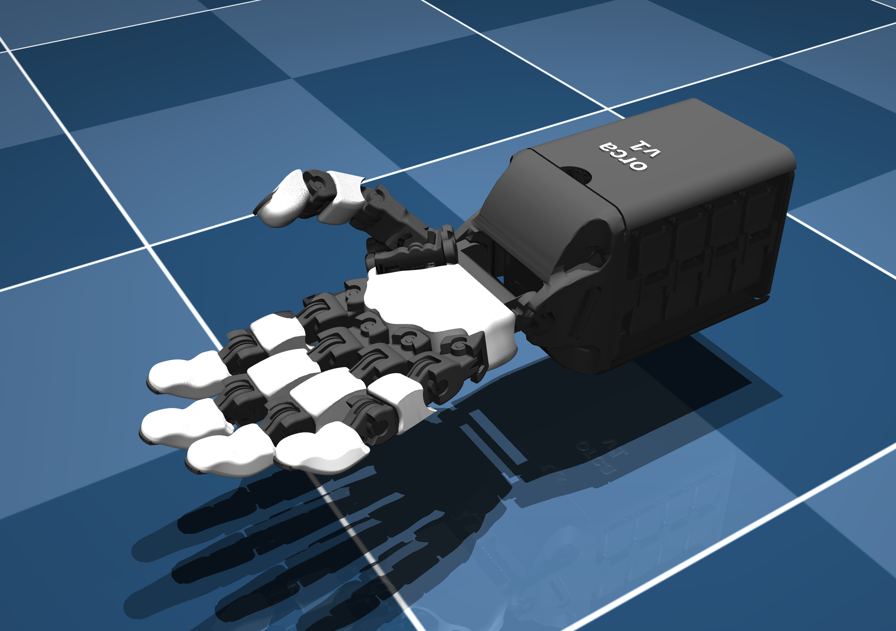
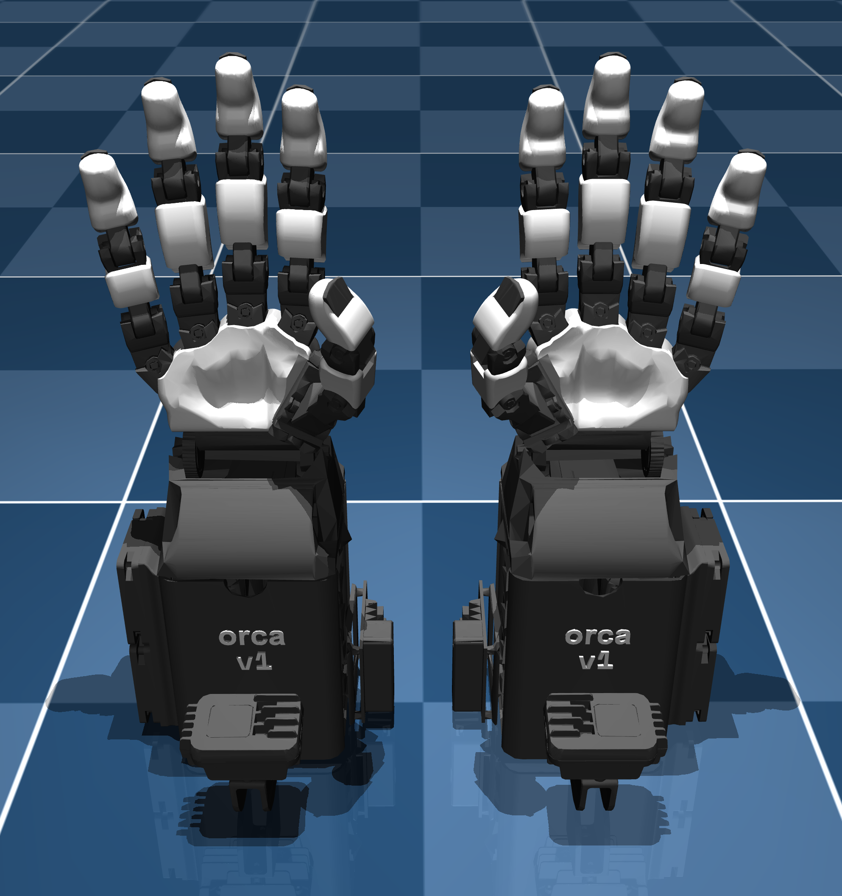

<div style="display: flex; gap: 10px;">
  
  
</div>

# Orcahand 模型描述

本仓库包含ORCA机械手的模型描述文件。当前仅提供MJCF格式的模型描述文件。其中'extended'扩展版本包含附加组件（含惯性属性），例如相机支架、U2D2控制板和散热风扇。

URDF格式描述文件即将推出——目前可使用转换工具如 [mjcf_urdf_simple_converter](GitHub - Yasu31/mjcf_urdf_simple_converter) or [mjcf2urdf](https://github.com/iory/mjcf2urdf) 将MJCF描述转换为URDF格式。

## 使用示例
1. 克隆本仓库：
   ```bash
   git clone git@github.com:orcahand/orcahand_description.git
   cd orcahand_description
   ```
2. 安装依赖项：
   ```bash
   pip install mujoco
   ```
3. 在MuJoCo中运行仿真测试程序：
   ```bash
   python3 test1.py #在mujoco中握拳后再张开
   ```
